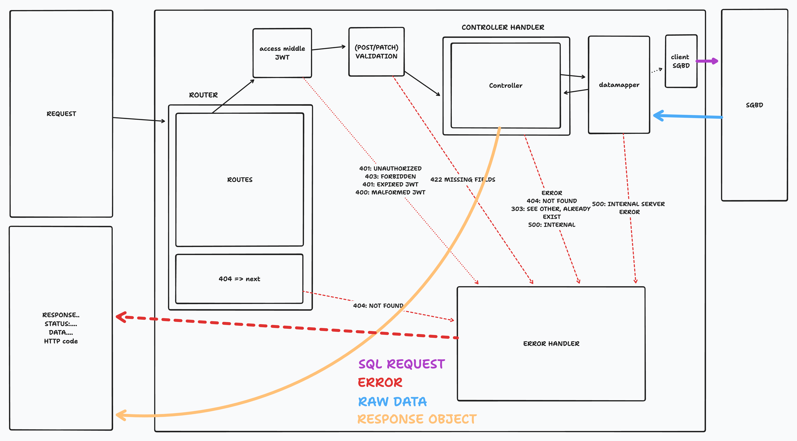
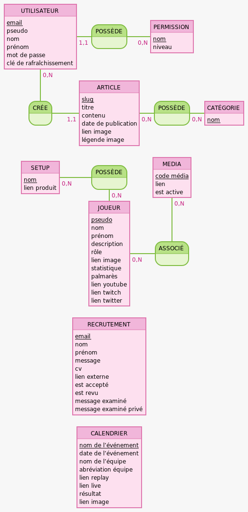

### GET STARTED: DEV MODE
1. Create a psql user and psql database

   user:`victoryzone` => `CREATE ROLE victoryzone WITH LOGIN PASSWORD 'victoryzone;'`

   database: `victoryzone` => `CREATE DATABASE victoryzone OWNER victoryzone;`
2. setup the sqitch conf file `cp sqitch.conf\ example sqitch.conf`

3. Do a first deployement with sqitch:
   -`sqitch deploy local`
   ***note**: if you don't have sqitch installed, [go there](https://sqitch.org/download/)*

4. Do your own seeding.
  *don't forget to asign admin to the user you want to create, also generate a passsword with [bcrypt](https://bcrypt-generator.com/)*

1. `npm i` to install the dependencies.

2. setting up the .env `cp .env\ example .env` (fill with the correct information)

3. `npm run dev`

### TYPICAL PATCH / POST REQUEST
[link](https://www.tldraw.com/r/v2D9rhIZWkk2TkVAMoco_32?viewport=-570%2C-956%2C4476%2C3586&page=page%3A1VJK9HJJQwed-H5qkpveL)



### ARCHITECTURE OF THE DATABASE



### ARCHITECTURE OF THE BACKEND
```
esport-website-backend/
┣ app/
┃ ┣ controllers/
┃ ┃ ┣ CoreController.js
┃ ┃ ┣ articleController.js
┃ ┃ ┣ authController.js
┃ ┃ ┣ calendarController.js
┃ ┃ ┣ categoryController.js
┃ ┃ ┣ mediaController.js
┃ ┃ ┣ recruitmentController.js
┃ ┃ ┗ teamController.js
┃ ┣ middlewares/
┃ ┃ ┣ __test__/
┃ ┃ ┃ ┗ authHandler.test.js
┃ ┃ ┣ authHandler.js
┃ ┃ ┣ controllerHandler.js
┃ ┃ ┣ errorHandler.js
┃ ┃ ┗ rateLimitHandler.js
┃ ┣ models/
┃ ┃ ┣ __test__/
┃ ┃ ┃ ┗ models.test.js
┃ ┃ ┣ clients.js
┃ ┃ ┗ dataMapper.js
┃ ┣ routers/
┃ ┃ ┣ api/
┃ ┃ ┃ ┣ articleRouter.js
┃ ┃ ┃ ┣ authRouter.js
┃ ┃ ┃ ┣ calendarRouter.js
┃ ┃ ┃ ┣ categoryRouter.js
┃ ┃ ┃ ┣ index.js
┃ ┃ ┃ ┣ mediaRouter.js
┃ ┃ ┃ ┣ recruitmentRouter.js
┃ ┃ ┃ ┗ teamRouter.js
┃ ┃ ┗ index.js
┃ ┣ services/
┃ ┃ ┣ __test__/
┃ ┃ ┃ ┗ cachingService.test.js
┃ ┃ ┣ mailingService/
┃ ┃ ┃ ┣ templates/
┃ ┃ ┃ ┃ ┣ adminTemplate.hbs
┃ ┃ ┃ ┃ ┣ adminTemplateBackUp.hbs
┃ ┃ ┃ ┃ ┣ applicantTemplateApplying.hbs
┃ ┃ ┃ ┃ ┣ applicantTemplateIsAccepted.hbs
┃ ┃ ┃ ┃ ┗ applicantTemplateIsNotAccepted.hbs
┃ ┃ ┃ ┗ index.js
┃ ┃ ┣ backupService.js
┃ ┃ ┣ cachingService.js
┃ ┃ ┣ corsService.js
┃ ┃ ┣ swaggerService.js
┃ ┃ ┗ uploadService.js
┃ ┗ validations/
┃   ┣ requestParams/
┃   ┣ schemas/
┃ ┃ ┃ ┣ article-schema.js
┃ ┃ ┃ ┣ calendar-schema.js
┃ ┃ ┃ ┣ category-schema.js
┃ ┃ ┃ ┣ login-schema.js
┃ ┃ ┃ ┣ media-schema.js
┃ ┃ ┃ ┣ recruitment-schema.js
┃ ┃ ┃ ┣ setup-schema.js
┃ ┃ ┃ ┗ team-schema.js
┃   ┗ validate.js
┣ mcd/
┃ ┣ mcd.mcd
┃ ┣ mcd.png
┃ ┗ mcd.svg
┣ migrations/
┃ ┣ deploy/
┃ ┃ ┣ domains.sql
┃ ┃ ┣ functions.sql
┃ ┃ ┣ init.sql
┃ ┃ ┗ views.sql
┃ ┣ revert/
┃ ┃ ┣ domains.sql
┃ ┃ ┣ functions.sql
┃ ┃ ┣ init.sql
┃ ┃ ┗ views.sql
┃ ┣ verify/
┃ ┃ ┣ domains.sql
┃ ┃ ┣ functions.sql
┃ ┃ ┣ init.sql
┃ ┃ ┗ views.sql
┃ ┗ sqitch.plan
┣ private/
┃ ┣ backup/
┃ ┃ ┗ dummy.pdf
┃ ┗ recruitment/
┃   ┗ dummy.pdf
┣ public/
┃ ┣ article/
┃ ┃ ┣ article-1.webp
┃ ┃ ┣ article-10.webp
┃ ┃ ┣ article-2.webp
┃ ┃ ┣ article-3.webp
┃ ┃ ┣ article-4.webp
┃ ┃ ┣ article-5.webp
┃ ┃ ┣ article-6.webp
┃ ┃ ┣ article-7.webp
┃ ┃ ┣ article-8.webp
┃ ┃ ┗ article-9.webp
┃ ┣ calendar/
┃ ┃ ┣ Fnatic-Logo-2020.webp
┃ ┃ ┣ G2_Esports_1.webp
┃ ┃ ┣ Karmine_Corp_logo_1.webp
┃ ┃ ┗ Team_Vitality_2020-2021.webp
┃ ┣ image/
┃ ┃ ┣ carousel-2.jpg
┃ ┃ ┣ carousel-3.jpg
┃ ┃ ┣ carousel.jpg
┃ ┃ ┗ fff.webp
┃ ┗ team/
┃   ┣ player_ali.webp
┃   ┣ player_axel.webp
┃   ┣ player_guillaume.webp
┃   ┣ player_manu.webp
┃   ┗ player_quentin.webp
┣ test.http/
┃ ┣ article.http
┃ ┣ calendar.http
┃ ┣ category.http
┃ ┣ image.http
┃ ┣ login.http
┃ ┣ recruitment.http
┃ ┣ team.http
┃ ┗ test.pdf
┣ .editorconfig
┣ .env
┣ .env example
┣ .eslintrc.js
┣ .gitignore
┣ README.md
┣ index.js
┣ jest.config.js
┣ package-lock.json
┣ package.json
┣ shapes.png
┣ sqitch.conf
┗ sqitch.conf example
```
